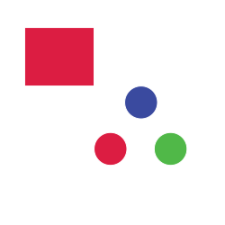
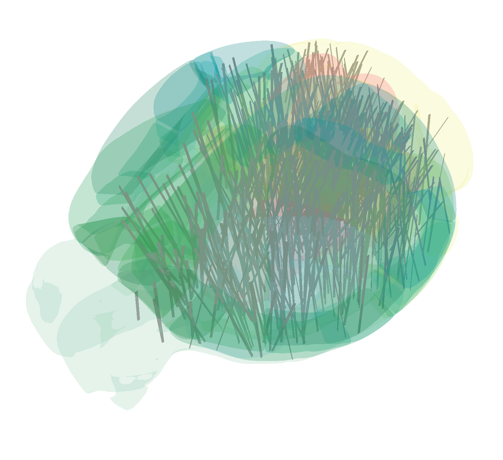
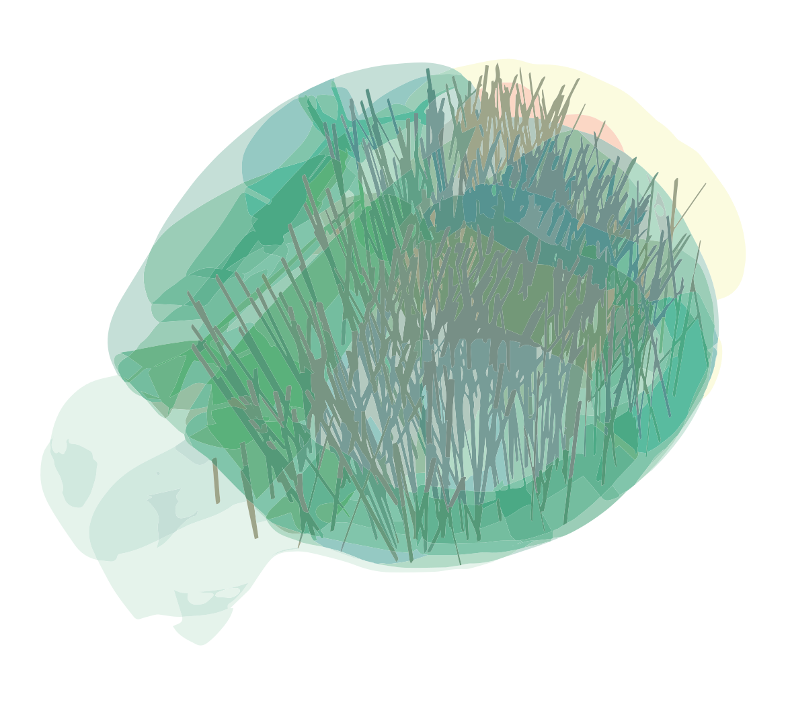

# Vector vs Raster

I've noticed over the last year that there tends to be a bit of confusion among people about why figures end up really large/small depending on the filesize you use. So I thought it would be helpful to share a few tips here. For people in the BWM and Repro Ephys groups, and the future Ephys Atlas and other new task forces I hope this will save you some time in the future when you are generating figures.

Here's some other links to places where you can find more information on raster vs vector graphics: [Adobe's website](https://www.adobe.com/creativecloud/file-types/image/comparison/raster-vs-vector.html) 

## The two ways to save images on a computer

### Raster images

A **raster** image is an image represented by individual pixels, where each pixel has a color.

- You're probably familiar with JPG and PNG, if you have an iPhone you've probably also seen the new HEIC format, there are many others
- Raster images are the correct format for images, e.g. histology slices, 2-photon data, etc
- Raster images have a resolution, like 1024x800
- Each pixel in the 1024x800 has a color associated with it, so at it's most basic an RGB image using 8 bytes per color channel has a total size of 1024x800x32 = 26 MB. Formats like PNG use compression algorithms to reduce this, without losing any information.
- The standard in 2023 is to use the PNG filetype for raster images
- It's generally only possible to *further* compress a raster if you are willing to give up some information. You can (1) lower the resolution. Or (2) throw out color or spatial information that is hard for the human visual system to see. Option #2 is how JPG works, it compresses images by throwing out information that we can't see visually, but that data will be gone forever.
- Programs like Paint, Photoshop, Photopea all work with rasterized images

### Vector graphics

A **vector** graphic is an image represented by lines and polygons, where each shape has a color.

- You might be less familiar with this kind of image
- Common filetypes are SVG, EPS, and in some cases PDF
- Vector graphics are the correct format for almost all scientific figures generated from Python or MATLAB code, if you save from matplotlib, seaborn, or the print command in MATLAB with a .PDF filetype, you will get a vector graphic
- Vector graphics have **no resolution**, you can scale them up or down without changing the file size.
- Inside the file, a vector graphic is just a list of points, polygons linking points, and colors, so in some cases the file sizes can be very small despite displaying very complex visuals
- The standard in 2023 is to use SVG or PDF
- It's generally not possible to compress a vector graphic, there are situations where shapes are overspecified and can be compressed, but these are rare
- Programs like Illustrator and Inkscape work with vector graphics

## Some examples

Here is a really basic vector graphic that I put together in Illustrator



This vector graphic is a whopping 797 bytes and can scale to any arbitrary resolution! Here is what's actually internally stored for this file:

```
<?xml version="1.0" encoding="utf-8"?>
<!-- Generator: Adobe Illustrator 27.2.0, SVG Export Plug-In . SVG Version: 6.00 Build 0)  -->
<svg version="1.1" id="Layer_1" xmlns="http://www.w3.org/2000/svg" xmlns:xlink="http://www.w3.org/1999/xlink" x="0px" y="0px"
	 viewBox="0 0 250 250" style="enable-background:new 0 0 250 250;" xml:space="preserve">
<style type="text/css">
	.st0{fill:#DC1D42;stroke:#FFFFFF;stroke-miterlimit:10;}
	.st1{fill:#3A4A9F;stroke:#FFFFFF;stroke-miterlimit:10;}
	.st2{fill:#50B848;stroke:#FFFFFF;stroke-miterlimit:10;}
</style>
<rect x="27.42" y="30.57" class="st0" width="77.12" height="65.02"/>
<circle class="st0" cx="122.78" cy="165.47" r="18.24"/>
<circle class="st1" cx="156.78" cy="113.83" r="18.24"/>
<circle class="st2" cx="189.59" cy="165.47" r="18.24"/>
</svg>
```

That's it! That file could even be compressed further by removing some of the unnecessary header information. If we re-save this file as a 250x250 pixel PNG


It now takes up 20KB, 20x more. If you zoom in, you'll also see that there are now compression artifacts around the edges of the circles while the vector graphic is perfectly crisp when you zoom in.

If this was saved as a Bitmap BMP file with no compression, it would require 250x250x32 bytes, or 2MB. So the PNG compression algorithm for this simple image gives us about 100x compression.

Here's now a more complex image:



This PNG file is quite complex and large, at 1572x1441 pixels. It's technically possible to convert an image like this one, which has fairly large chunks of colors, into a vector graphic. If we do that we get this:



Note that this looks pretty bad compared to the original image, we've basically done some bad compression on the image. This file is also actually *larger* than the original image. This is because an image like this one doesn't lend itself well to being represented by shapes with flat colors inside of them.

## Building scientific figures

An important thing to note is that **PDF** files can contain both vector and raster elements in them. This is really useful for us, since in scientific figures for papers we often want to show both images of our raw data (such as histology) alongside scatterplots, barplots, etc, which are all easily represented as vectors.

If you are trying to make your figures as small as possible, the general steps to do this are:

1. Save all figure panels from Python/MATLAB as vector graphics (SVG, or PDF), although these programs may ask for a resolution this is somewhat arbitrary as you can scale them up or down later as needed.
2. Save images (histology, raw imaging data, etc) as rasters (PNG) at high resolution. In general you want at least 300 pixels per inch for the final output. For a one-column panel of a 4-column figure, intended to be read on regular printer paper (8.5"), make sure you have at least 500x500 pixels.

That's it. Don't do any compression at this point!

### Compiling multi-panel figures

When compiling multi-panel figures use either InDesign or Illustrator and make sure to save to the PDF filetype, the program will correctly keep vectors as vectors and rasters as rasters.

You'll know that this worked if the total filesize of the multi-panel figure is more or less the same as the file sizes of the original files. A PDF is really just a bucket where you can combine elements, it only adds a few bytes of additional header information.

### Troubleshooting

If your final multi-panel PDF is too large, the most likely offender are any raster images you included. Before reducing the resolution, try running them through a visual compression algorithm (e.g. using tinypng.com), but *make sure to keep a backup of the original* since any compression you do will cause permanent loss of information. If visual compression fails to make enough of a reduction in file size, then reduce the resolution.

Figures rendered as vector graphics should be relatively small in size. There are a few situations where you might get very large file sizes from vector graphics, usually when you are exporting something that is basically an image, e.g. anything with a continuous color gradient. A very large file size on a vector graphic usually means that it's basically an image and that you should try rasterizing it. Either re-save the figure as a PNG file from Python/MATLAB, or using Illustrator, select `File > Export As` and export the file to a PNG with sufficient resolution (300+ pixels per inch).

In general, converting a mixed vector/raster PDF that came out of InDesign/Illustrator to a raster image is a *bad idea* and will only make the file larger while reducing the quality of the figure. Focus on tweaking the file size of the components.
